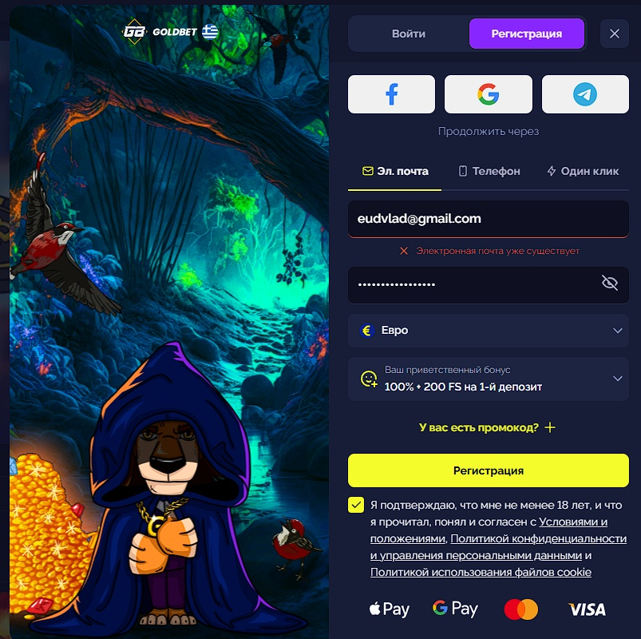
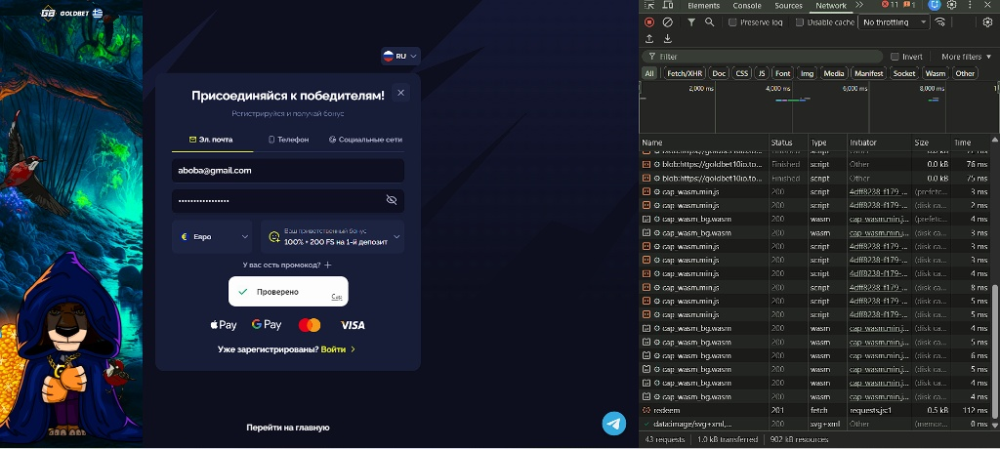
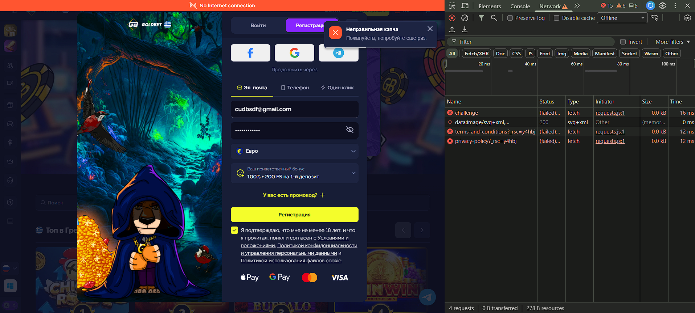

# Отчет о тестировании: Регистрация и авторизация Goldbet

## Общая информация
- **Дата проверки:** 2026-05-07
- **Затраченное время:** 2 часа
- **Объект:** Страница регистрации и авторизации онлайн-казино
- **Исходный URL:** https://goldbet.io/registration
- **Тип проверки:** Ручное исследовательское и функциональное тестирование

## Ограничения и окружение
Тестирование проводилось методом черного ящика на UI-уровне. При открытии исходного URL происходит маршрутизация на актуальное зеркало (вида goldbet*.top). Проверки выполнялись на конечном домене.

## Исследовательское тестирование

Проверенные сценарии:
- Механика редиректа на зеркало.
- Полный флоу регистрации через E-mail и Телефон до этапа прохождения капчи.
- Работоспособность социального входа (Facebook, Google, Telegram).
- Сохранение состояния формы при переключении между вкладками методов регистрации.
- Переходы между режимами входа и регистрации.
- Обработка параметров в URL (валюта, бонус) и реакция системы на невалидные значения.
- Логика UI при работе с промокодами.
- Валидация чекбокса подтверждения возраста (18+) и согласия с правилами.
- Попытки сабмита формы с некорректным форматом E-mail (включая спецсимволы и теги).
- Поведение системы при двойном клике и на медленном интернет-соединении.
- Доступность юридических документов (Terms, Privacy, Cookies).

## Функциональное тестирование

### Что работает как задумано
- Форма загружается корректно. Есть верхний блок быстрого входа через соцсети и три основные вкладки: E-mail, Телефон, Один клик.
- Отправить пустую форму нельзя — кнопка подтверждения неактивна. Обход блокировки через код страницы также не позволяет отправить запрос.
- При выборе регистрации по телефону корректно подставляется код страны (+30).
- Переключение между методами регистрации происходит плавно, без перезагрузки страницы.
- Система умеет обрабатывать битые ссылки. Если в URL передать несуществующую валюту или бонус, интерфейс автоматически сбрасывает их до стандартных значений (Евро, базовый бонус).
- Ссылки на правила и политику конфиденциальности рабочие и ведут на страницы текущего зеркала.

### Фактические результаты по негативным сценариям
1. **Ввод кириллицы или мусорных символов в E-mail:** Клиентская валидация работает отлично. Ошибка формата подсвечивается моментально, до вызова капчи.
2. **Блокировщики рекламы (AdBlock / Brave):** Проблем нет. Кнопки соцсетей и скрипты отображаются и работают штатно.
3. **Смена метода на «Один клик» после заполнения данных:** Введенные данные стираются. Это логичное и правильное поведение, так как регистрация в один клик генерирует аккаунт автоматически без ручного ввода.
4. **Заход с IP-адреса запрещенной страны (США):** Блокировка срабатывает надежно еще до загрузки интерфейса.

---

## Баг-репорты

### BUG-03: Уязвимость перечисления пользователей (User Enumeration)
- **Критичность:** Medium | **Приоритет:** Medium
- **Шаги:** Ввести в форму существующий в базе E-mail и заведомо неверный пароль. Нажать регистрацию.
- **Фактический результат:** Система явно отвечает «Электронная почта уже существует».
- **Ожидаемый результат:** Система не должна раскрывать факт наличия почты в базе. Нужна нейтральная ошибка (например, «Неверный логин или пароль»).
- **Влияние на бизнес:** Позволяет злоумышленникам автоматически проверять слитые базы почт на принадлежность к казино.

### BUG-04: Тихий отказ регистрации при снятом чекбоксе 18+
- **Критичность:** Medium | **Приоритет:** Low
- **Шаги:** Заполнить данные, снять чекбокс 18+, нажать регистрацию, пройти капчу.
- **Фактический результат:** Регистрация не происходит. Анализ сетевых запросов показывает, что данные даже не уходят на сервер — браузер блокирует процесс из-за снятой галочки, но не выводит пользователю сообщение об ошибке.
- **Рекомендация:** Заменить кликабельный чекбокс на обычный текст под кнопкой «Нажимая кнопку, вы подтверждаете, что вам есть 18 лет...». Это полностью исключит данную проблему.

### BUG-05: Ошибка капчи вместо ошибки сети
- **Критичность:** Minor | **Приоритет:** Medium
- **Шаги:** Заполнить форму, отключить интернет, попытаться пройти капчу.
- **Фактический результат:** Выводится ложное сообщение «Неправильная капча».
- **Ожидаемый результат:** Понятное уведомление о потере соединения с сервером.

### BUG-01: Отсутствие доступных имен у кнопок соцсетей
- **Критичность:** Medium | **Приоритет:** Low
- **Фактический результат:** Кнопки Facebook, Google и Telegram не имеют атрибута `aria-label`. Программы для чтения экрана не могут озвучить их назначение незрячим пользователям.

### BUG-02: Редирект на зеркало происходит без индикации загрузки
- **Критичность:** Low | **Приоритет:** Medium
- **Фактический результат:** Пользователь перенаправляется на другой домен без визуального сопровождения. При медленном интернете это выглядит как зависание интерфейса.

---

## Ответы на вопросы бизнеса

**Что здесь может быть самым дорогим багом?**
Для онлайн-казино самое дорогое — это потеря горячего трафика на входе. Самыми критичными точками здесь являются падение сервиса капчи и отвал авторизации через Google или Telegram. Социальный логин дает максимальную конверсию с мобильных устройств. Если эти элементы сломаются, большинство пользователей не станет тратить время на ручной ввод почты и пароля, что приведет к прямым потерям первых депозитов.

**Что можно улучшить в UI/UX?**
1. Внедрить лоадер при маршрутизации на зеркала (например, фразу «Безопасное подключение...» или анимацию логотипа), чтобы сгладить опыт ожидания.
2. Сделать выбранный приветственный бонус более заметным, чтобы пользователь четко понимал свою выгоду на этапе ввода данных.
3. Отказаться от интерактивного чекбокса с правилами в пользу текстового дисклеймера под кнопкой регистрации. Это сделает флоу более линейным и надежным.
